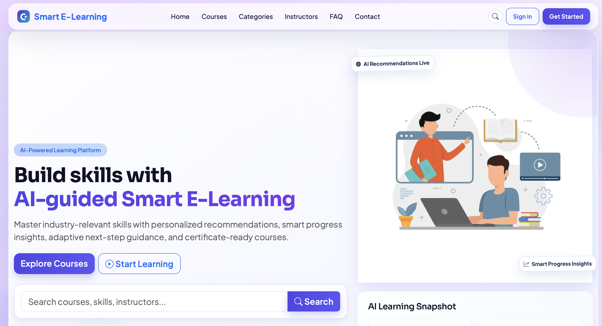
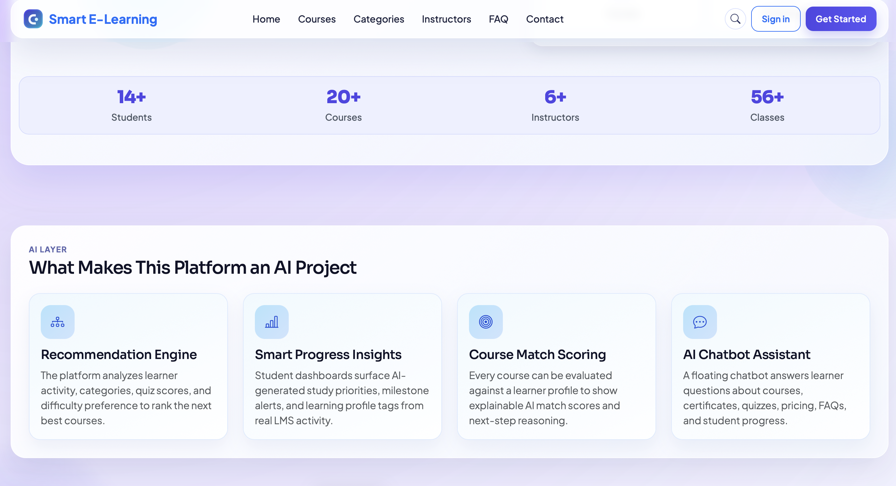
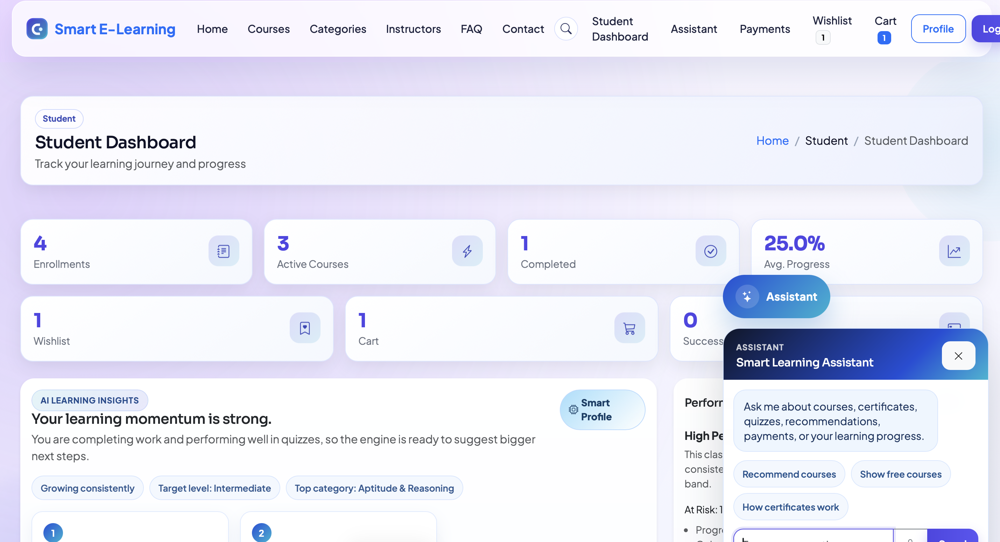
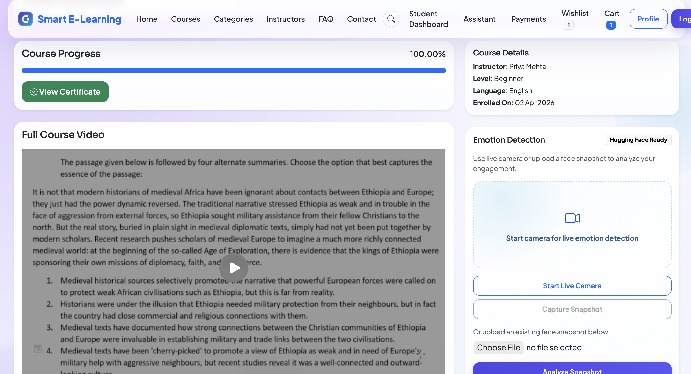
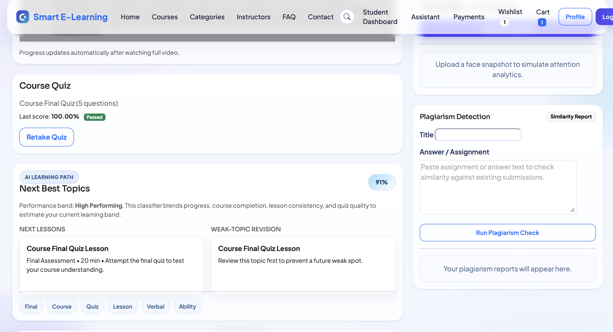
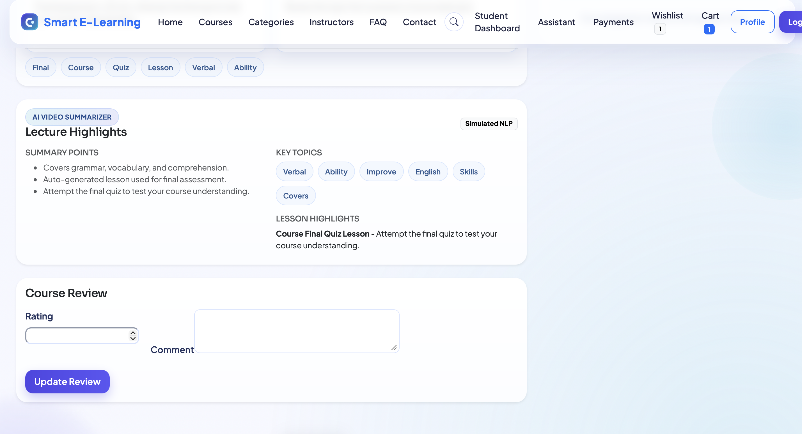

# Smart E-Learning Management System

An AI-enhanced Learning Management System built with Django, focused on personalized recommendations, learner analytics, smart quiz generation, engagement analysis, and explainable learning guidance. The platform supports students, instructors, and admins while showcasing how machine learning style systems can be integrated into a real product workflow.

This project is especially suited for an AI/ML-focused portfolio because it demonstrates recommendation logic, learner profiling, NLP-style content processing, rule-based prediction pipelines, explainable scoring, and optional computer-vision-based engagement analysis inside a working web application.

## Highlights

- Role-based LMS for students, instructors, and platform admins
- Applied AI/ML features integrated into a real education product workflow
- Course catalog with categories, search, filters, featured courses, ratings, wishlist, and cart
- Mock checkout flow with UPI, card, net banking, and wallet payment options
- Course progress tracking, quiz attempts, result history, and certificate generation
- Instructor tools for course, section, lesson, video, and quiz management
- Admin portal for users, courses, categories, enrollments, reviews, contact messages, and platform metrics
- AI-powered learner experience with recommendations, chatbot guidance, course match scores, performance insights, quiz generation, video summaries, and engagement analysis
- Seeded demo data for quick project walkthroughs and viva/interview demos
- Vercel-compatible entry point plus standard Django local development setup

## Product Walkthrough

### 1. AI-first landing page

Shows the platform positioning around AI-guided learning, course discovery, and personalized learning support.



### 2. Explainable AI layer

Highlights the core AI product concepts surfaced in the UI: recommendation engine, progress insights, course match scoring, and chatbot assistance.



### 3. Advanced AI modules

Demonstrates additional AI-driven features built into the LMS, including video summarization, emotion detection, voice assistant support, analytics, and plagiarism checks.


### 4. Student dashboard with assistant

The dashboard combines learning analytics, profile signals, progress tracking, and an LMS-aware chatbot that responds to student questions.



### 5. Course workspace with engagement analysis

Inside an enrolled course, the learner can track progress, unlock certificates, watch course content, and use emotion detection with optional Hugging Face-backed analysis.



### 6. Learning path + plagiarism detection

Shows predictive next-step guidance, weak-topic revision support, quiz performance, and assignment similarity checking in the course workspace.



### 7. AI video summarizer output

Illustrates the generated lecture highlights, extracted key topics, and lesson summary view presented inside the student experience.



## Tech Stack

| Layer | Technologies |
| --- | --- |
| Backend | Python, Django 5 |
| Frontend | HTML5, CSS3, JavaScript, Bootstrap 5 |
| Database | SQLite for development |
| Charts/UI | Chart.js, Bootstrap components |
| Media | Django file/image uploads, Pillow |
| Deployment | Gunicorn, WhiteNoise, Vercel entry point |
| Optional AI Provider | Hugging Face or Google Vision for engagement/emotion analysis |

## Core Modules

```text
apps/
  accounts/   Custom user model, student/instructor profiles, authentication
  core/       Public pages, dashboards, chatbot, FAQs, contact, site services
  courses/    Categories, courses, sections, lessons, resources, quizzes, reviews
  learning/   Enrollments, progress, payments, certificates, AI services
smart_lms/    Project settings, URLs, WSGI/ASGI, global context processors
templates/    Public, student, instructor, admin, and account templates
static/       CSS, JavaScript, images, and dashboard chart scripts
api/          Vercel-compatible Django handler
```

## Feature Details

### Student Experience

- Student registration, login by username or email, profile management, and password changes
- Browse courses by category, level, price, rating, popularity, and search terms
- Add courses to wishlist or cart before checkout
- Enroll in free courses immediately or use the mock payment gateway for paid courses
- Track lesson/course progress and continue active learning paths
- Attempt quizzes, view scores, and pass/fail status
- Receive certificates after completing 100% course progress and passing a course quiz
- Submit reviews and ratings for completed/enrolled courses
- View AI-ranked recommendations, progress insights, and next-step guidance

### Instructor Experience

- Instructor dashboard with course and student activity metrics
- Create, update, publish, and delete courses
- Manage sections, lessons, notes, uploaded videos, resources, and quizzes
- Generate quiz questions from lesson content using the smart quiz generator
- View enrolled students for instructor-owned courses
- Review engagement and learning analytics for course activity

### Admin Experience

- Dedicated platform admin dashboard
- Manage users, categories, courses, enrollments, reviews, FAQs, testimonials, and contact messages
- Monitor course popularity, enrollment counts, platform statistics, and quiz performance
- Access Django admin through `/admin/` and alternate admin through `/super-admin/`

## AI-Assisted Features

The project includes an explainable AI layer that works without paid API keys by using course content, learner history, quiz results, progress, wishlist/cart activity, and collaborative signals.

- Personalized course recommendations with match percentage and reasons
- Learner profile builder based on interests, enrollments, progress, quiz scores, wishlist, and cart
- Course detail AI-fit score for logged-in students
- Student dashboard insights with learning stage, risk/performance band, and action items
- Learning path optimizer that recommends next lessons and weak-topic revision
- LMS-aware chatbot for course search, progress questions, certificates, quizzes, pricing, and FAQs
- Smart quiz generator that creates MCQs from lesson notes and course content
- Video summary generator using lesson metadata and notes
- Assignment plagiarism checker using similarity scoring
- Engagement snapshot analysis with local fallback and optional Hugging Face/Google Vision providers

## AI/ML Engineering Focus

This project is positioned as an applied AI/ML system rather than only a CRUD web app.

- Built a recommendation engine using content signals, collaborative patterns, learner interests, progress, and quiz performance
- Designed explainable scoring so every recommendation includes interpretable reasons instead of black-box outputs
- Implemented learner profiling from behavioral data such as enrollments, wishlist activity, cart activity, completion rate, and assessment outcomes
- Added performance prediction logic that estimates learner risk bands from progress, consistency, and quiz quality
- Created NLP-style utilities for keyword extraction, sentence selection, topic summarization, and quiz generation from lesson notes
- Integrated optional external inference providers for emotion/engagement analysis with graceful fallback to local heuristics
- Used AI outputs directly in product features such as dashboard insights, course match labels, chatbot replies, and revision guidance

## ML Concepts Demonstrated

- Recommendation systems
- Explainable ranking
- Feature engineering from user behavior
- Rule-based predictive analytics
- NLP-style text tokenization and summarization
- Similarity-based plagiarism detection
- Human engagement/emotion classification
- Applied AI product integration

## Database Design

Important models include:

- `User`, `StudentProfile`, `InstructorProfile`
- `Category`, `Course`, `CourseSection`, `Lesson`, `LessonResource`
- `Quiz`, `Question`, `Option`, `Review`
- `Enrollment`, `LessonProgress`, `Result`, `Certificate`
- `Wishlist`, `CartItem`, `MockPaymentTransaction`
- `EngagementSnapshot`, `AssignmentSubmission`
- `FAQ`, `ContactMessage`, `Testimonial`

The schema uses foreign keys, unique constraints, model indexes, role checks, and timestamped base models to keep data organized and reliable.

## Getting Started

### 1. Clone the repository

```bash
git clone <your-repository-url>
cd "E-Learning Management"
```

### 2. Create and activate a virtual environment

macOS/Linux:

```bash
python3 -m venv .venv
source .venv/bin/activate
```

Windows PowerShell:

```powershell
python -m venv .venv
.\.venv\Scripts\Activate.ps1
```

### 3. Install dependencies

```bash
pip install -r requirements.txt
```

### 4. Configure environment variables

```bash
cp .env.example .env
```

Update `.env` with a secure `DJANGO_SECRET_KEY` for production use.

### 5. Apply migrations

```bash
python manage.py migrate
```

### 6. Load demo data

```bash
python manage.py seed_demo_data
```

### 7. Run the development server

```bash
python manage.py runserver
```

Open the app at:

- Home: `http://127.0.0.1:8000/`
- Django Admin: `http://127.0.0.1:8000/admin/`
- Alternate Admin: `http://127.0.0.1:8000/super-admin/`

## Demo Credentials

| Role | Username | Password |
| --- | --- | --- |
| Admin | `platformadmin` | `Admin@123` |
| Instructor | `anita_shah` | `Pass@123` |
| Instructor | `rohan_patel` | `Pass@123` |
| Instructor | `meera_joshi` | `Pass@123` |
| Student | `aisha` | `12345` |
| Student | `rahul` | `12345` |
| Student | `sneha` | `12345` |

Student users can also log in with their seeded email IDs, for example `aisha@gmail.com`.

## Optional AI Provider Setup

The platform works without external API keys. For optional real emotion/engagement analysis, configure one of the supported providers.

Hugging Face:

```bash
export HF_TOKEN="your_hugging_face_token"
export HUGGINGFACE_EMOTION_MODEL="dima806/facial_emotions_image_detection"
python manage.py runserver
```

Google Vision:

```bash
export GOOGLE_CLOUD_VISION_API_KEY="your_google_vision_api_key"
python manage.py runserver
```

If no provider is configured or the provider is unavailable, the app uses the local fallback classifier.

## Useful Commands

```bash
python manage.py makemigrations
python manage.py migrate
python manage.py seed_demo_data
python manage.py createsuperuser
python manage.py runserver
```

## Certificate Rule

A certificate is issued only when:

1. The student reaches 100% course progress.
2. The student passes at least one quiz from that course.

Certificates are generated with unique certificate numbers such as `SEL-2026-XXXXXXXX`.

## Deployment Notes

- `api/index.py` exposes the Django WSGI app for Vercel-style deployments.
- `STATIC_ROOT` is configured for collected static files, and deployment dependencies are listed in `requirements.txt`.
- SQLite is used for local development; for production, configure a managed relational database.
- Set `DJANGO_SECRET_KEY`, `DJANGO_DEBUG=False`, `DJANGO_ALLOWED_HOSTS`, and `DJANGO_CSRF_TRUSTED_ORIGINS` in production.
- Do not commit `.env`, `db.sqlite3`, virtual environments, uploaded `media/`, or generated `staticfiles/`.

## Resume Talking Points

- Built an AI-enhanced learning platform that combines recommendation logic, learner analytics, quiz generation, and engagement analysis inside a production-style Django application.
- Implemented an explainable recommendation engine using learner interests, enrollment history, completion behavior, quiz results, and collaborative signals.
- Developed NLP-style pipelines for keyword extraction, content summarization, and auto-generation of quiz questions from lesson notes.
- Designed predictive learner insights using progress, assessment quality, and activity patterns to estimate student performance bands and next-step actions.
- Added similarity-based plagiarism checks and optional Hugging Face/Google Vision inference for engagement classification.
- Integrated AI features into user-facing product workflows including course ranking, chatbot assistance, dashboards, revision planning, and certificate readiness tracking.
- Structured the system with modular Django apps, reusable service layers, and seeded demo data for fast experimentation and portfolio presentation.

## Project Status

This project is ready for GitHub portfolio submission and resume linking. Before sharing publicly, verify that `.env`, `db.sqlite3`, uploaded media, and virtual environment folders are not committed.
